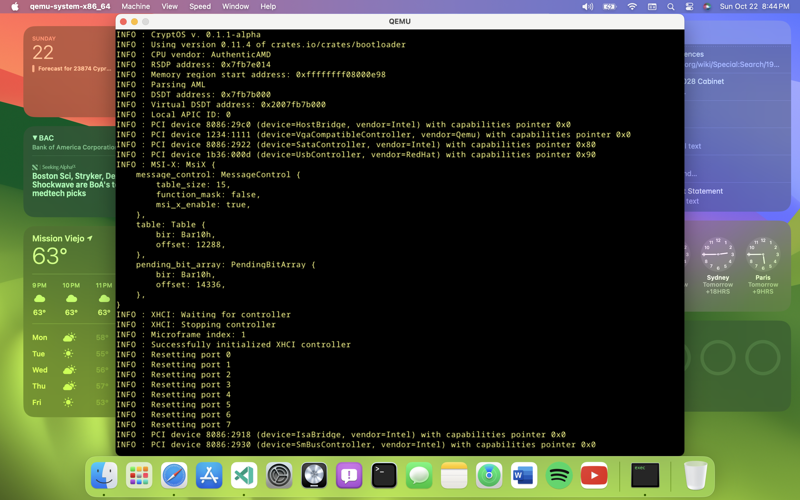

# CryptOS: A pure Rust hybrid kernel project aimed at fixing Linux's (and Redox's) shortcomings

Well, folks, most of this kernel's features are at least prototyped and the compiled file size is now clocking in at 18.6MB which is even larger than the Mach kernel inside the core of macOS (18.1MB), so I'm now ready to invite collaboration and get this show on the road. Named after the fact that development began on my Ethereum mining rig, CryptOS is a kernel that I've been working on nonstop since 2021 and released the source code to in 2022 when I ran into some stumbling blocks getting interrupts properly configured (thankfully the @rust-osdev team has some fantastic documentation and is extremely helpful). Fast forward to 2023, however, and now the basic kernel design is beginning to properly take shape, thanks to crates like [`redox_syscall`](https://crates.io/crates/redox_syscall) (yes, the Redox team has released their entire system call API onto crates.io which makes it easily portable to other kernels) and a little-known highly unstable Rust language feature known as [generators](https://doc.rust-lang.org/beta/unstable-book/language-features/generators.html) which make the process of setting up preemptive multitasking fairly straightforward.

The reason for the hybrid kernel design is driver segregation by license: the reason why "binary blobs" exist in the Linux kernel is because it's licensed under GPLv2 and Linus Torvalds has made it emphatically clear that he never wants to use GPLv3 because it would break a lot of hardware support due to its monolithic nature. With a strict microkernel, sure that goes away, but then you're left with much slower performance due to process count overhead. Using a hybrid kernel makes it possible to have FOSS drivers in kernel mode and proprietary drivers in user mode, eliminating both of these problems.

Now why GPLv3 as the kernel license, you may ask? Because it includes a built-in protection against what Richard Stallman calls "Tivoization" — or in layman's terms, bootloader locks — by requiring that all bootloader locks also be licensed under its terms. As such, it helps to avoid the problem that Android has with locked bootloaders on smartphones.

## What works already

* Basic I/O
* Heap allocation
* Interrupts
* ACPI tables/AML parsing
* Disk I/O (AHCI — driver is based on a port of the one already used in [Aero](https://github.com/Andy-Python-Programmer/aero) which is also GPLv3)

## Written but not tested

* [File system](src/fs/hmfs.rs) — HMFS, based on a linked list of HashMaps (hence the acronym) in order to make realtime checksumming and metadata forking possible. Only have the basic structure down; it's going to take a lot more contributions (or personal research) to figure out how to write these HashMaps to disk or read them therefrom, for example.
* [Task scheduler](src/process/mod.rs) — see Issue #12; takes a unique approach compared to most schedulers. Instead of using the loop at the end of the kernel's entry point (like Redox) or the timer interrupt handler (like Linux), CryptOS's task scheduler is configured to use the `IPI_WAKE` interrupt handler — and send itself to the next available APIC ID after it runs, [iterating in a cycle](https://doc.rust-lang.org/core/iter/trait.Iterator.html#method.cycle), while using atomics to prevent race conditions as the robin is rounded. This way, all available CPU power across all cores is taken full advantage of at the scheduler level instead of the application level, which in turn drastically removes a lot of workload from user-mode developers who need access to a lot of computing power.
* Kernel-mode [compositing framework](src/drm/mod.rs) — the use of the wakeup IPI as the task scheduler frees up the use of the loop at the end of the kernel's entry point for another purpose: rendering. Thanks to the power and portability of the [`embedded_graphics`](https://crates.io/crates/embedded-graphics) crate, that's exactly what it's being used for here: a compositing table is defined as a static `spin::RwLock<Vec<Canvas>>` which is looped through and blended with the framebuffer on the fly, and it also uses AVX instead of a GPU driver to accelerate the computations, thus freeing up all GPUs for general purpose usage by developers who might need that extra power for their use cases. As for why I chose to bake a compositor into the kernel to the potential shagrin of many Unix philosophy hardliners: Apple put their GUI in their kernel long before Microsoft and because macOS is also Unix-like it's still just as stable as Linux for the most part even on unauthorized "Hackintosh" hardware. What's more, compositing is something that as of 2023 all hardware less than 10 years old can easily handle.
* Kernel-mode backend to the `redox_syscall` crate (only partially complete)

## Not yet started

* XHCI — I do already depend on [a crate](https://github.com/rust-osdev/xhci) for this, but need to study how the APIs that said crate exposes work first in order to actually use that dependency. This is particularly important for getting keyboards, mice, and USB mass storage working properly.
* Support for CPU architectures other than x86_64
* NVMe
* Initramfs — the bootloader crate did recently add support for this in version 11.3, but figuring out how to properly take advantage of that support (or what archive formats it supports, for that matter) is going to be tricky.
* User mode

## What it looks like (for now):

Far from complete in terms of what works, but this is what's actually hooked into the kernel's entry point for now (this doesn't include any written-but-untested code):

# Contributing
Although it's only been tested on Arch Linux on my mining rig and macOS on my 2020 M1 MacBook Pro, the [runner crate](runner/src/main.rs) in the kernel workspace has some built-in checks that, on Linux in particular, automatically install the necessary dependencies, particularly if you're running Ubuntu or anything Arch-based (Fedora users, don't hesitate to contribute your own set of dependencies to the runner so it can work on your end). If you're running on Windows or macOS, however, those dependencies are:

* Rust (obviously)
* QEMU (for testing)
* 7-zip and GCC (for compiling OVMF, which is necessary for QEMU to emulate UEFI)

The [rust-toolchain.toml](rust-toolchain.toml) file is parsed by rustup to automatically install the necessary Rust toolchain components, so if you have Rust installed through rustup, those toolchain components will be installed automatically on the first compilation attempt as well.

The runner, meanwhile, not only installs dependencies if your host OS is Linux but also has the ability to automatically pass the necessary flags to QEMU to get it to run properly (via the `--boot` flag) and furthermore can also create a bootable USB flash drive with CryptOS on it for real hardware testing from any Unix-like system (via the `--write /dev/sdX` flag, where `/dev/sdX` is the USB flash drive to write it to). This should make testing by contributors an absolute breeze.

## Cargo aliases

Because of how my runner crate has grown into a testing powerhouse, I've also defined some important aliases in my [Cargo configuration file](.cargo/config.toml):

* `cargo bin` — aliased to `cargo run --package runner --`. This makes it possible to, from the kernel's workspace, run `cargo bin` by itself to build the kernel without running it, `cargo bin --boot` to test the kernel in QEMU, and `cargo bin --write /dev/sdX` (again, where `/dev/sdX` is the device you want to write to) to create a bootable USB flash drive with CryptOS on it for real hardware testing.
* `cargo asm` — aliased to `cargo rustc --package runner -- --emit=asm -o target/x86_64-unknown-none/debug/cryptos.S`. This makes it possible to debug faults by outputting assembly and reading it.